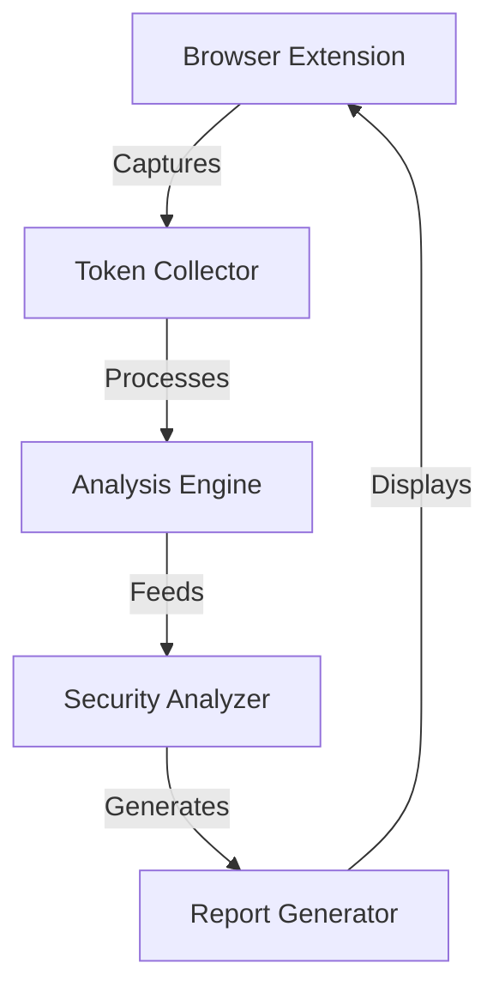

Let me create a professional README.md for your session security analyzer project that clearly communicates its purpose, features, and setup instructions.

# Session Security Analyzer

A browser extension for automated analysis and security assessment of web application session management implementations. This tool helps developers and security professionals identify vulnerabilities in session handling mechanisms and provides actionable recommendations for improvement.

## Overview

Session Security Analyzer continuously monitors and analyzes session management implementations in web applications, focusing on:

- Session token generation patterns and entropy
- Cookie security configurations
- Session lifecycle management
- Implementation of security best practices
- Vulnerability detection and assessment



## Features

The extension operates in two distinct modes to provide comprehensive session security analysis:

Passive Monitoring Mode:
- Automatic interception of session-related HTTP headers
- Real-time monitoring of cookie operations
- Tracking of local and session storage modifications
- Authentication form submission analysis

Active Analysis Mode:
- On-demand deep security scans
- Real-time vulnerability detection
- Detailed security reports
- Actionable remediation guidance

## Installation

1. Clone the repository:
```bash
git clone https://github.com/yourusername/session-security-analyzer.git
cd session-security-analyzer
```

2. Install dependencies:
```bash
npm install
```

3. Build the extension:
```bash
npm run build
```

4. Load the extension in your browser:
   - Open Chrome/Firefox and navigate to the extensions page
   - Enable Developer Mode
   - Click "Load unpacked extension"
   - Select the `dist` directory from the project folder

## Development Setup

The project uses a modular architecture with the following key components:

- Browser Extension Frontend: Handles user interface and data collection
- Token Analysis Engine: Processes and analyzes session tokens
- Security Rule Engine: Evaluates security patterns and best practices
- Reporting Service: Generates detailed security assessments

### Prerequisites

- Node.js (v14 or higher)
- npm (v6 or higher)
- Chrome or Firefox browser

## Usage

1. Click the extension icon in your browser to open the popup interface
2. Select the desired analysis mode (Passive or Active)
3. View real-time security alerts and recommendations
4. Access detailed reports through the dashboard interface

## Testing

Run the test suite:
```bash
npm test
```

Run specific test categories:
```bash
npm run test:unit        # Unit tests
npm run test:integration # Integration tests
```

## License

This project is licensed under the MIT License - see the LICENSE file for details.

## Team

- John Moore
- Neal Kimchi

## Acknowledgments

This project was developed as part of the CS 433/533 Computer Security course at the University of Oregon, Winter 2025.