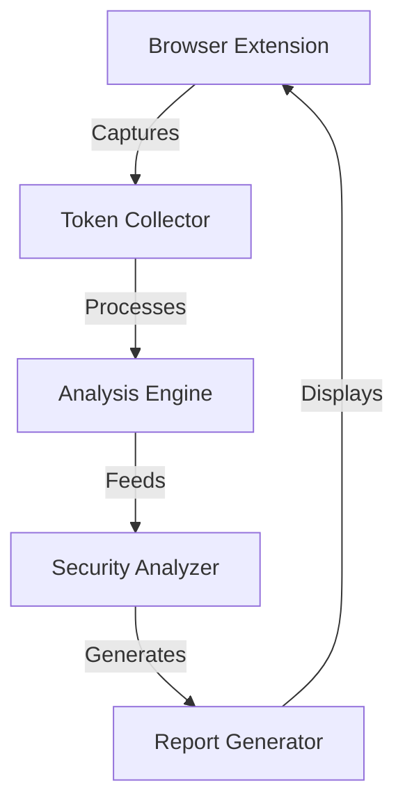

Based on your project proposal and constraints, I'll design a detailed system architecture for your browser extension focused on session security analysis. This design aims to be implementable within your 10-hour per week time constraint while delivering meaningful security insights.

# Session Security Analyzer - System Architecture Design

## 1. High-Level Architecture

The system will follow a modular architecture with three main components:

1. Browser Extension Frontend
2. Token Analysis Engine
3. Reporting Service

### Component Interaction Flow



## 2. Detailed Component Specifications

### 2.1 Browser Extension Frontend

The extension will operate in two modes:

1. **Passive Monitoring Mode**
   - Automatically intercepts and logs session-related HTTP headers
   - Monitors cookie operations through the browser's cookie API
   - Tracks localStorage and sessionStorage modifications
   - Implements event listeners for authentication-related form submissions

2. **Active Analysis Mode**
   - Triggers on-demand deep scans of current session mechanisms
   - Provides real-time feedback through a popup interface
   - Allows manual initiation of security checks

Implementation specifications:

```javascript
// Core Extension Structure
{
  manifest_version: 3,
  permissions: [
    "webRequest",
    "cookies",
    "storage",
    "activeTab",
    "scripting"
  ],
  background: {
    service_worker: "background.js"
  },
  content_scripts: [{
    matches: ["<all_urls>"],
    js: ["tokenCollector.js"]
  }]
}
```

### 2.2 Token Analysis Engine

The engine will implement the following analyzers:

1. **Token Structure Analyzer**
   - Length validation
   - Entropy measurement
   - Pattern detection
   - Encoding verification

2. **Token Behavior Analyzer**
   - Lifecycle tracking
   - Renewal patterns
   - Expiration policy
   - Scope analysis

Core analysis implementation:

```javascript
class TokenAnalyzer {
  async analyzeToken(token) {
    return {
      entropy: this.calculateEntropy(token),
      patterns: this.detectPatterns(token),
      strength: this.assessStrength(token),
      vulnerabilities: await this.checkVulnerabilities(token)
    };
  }

  calculateEntropy(token) {
    // Shannon entropy calculation
    let freq = new Map();
    let entropy = 0;
    // Implementation details...
    return entropy;
  }
}
```

### 2.3 Security Rule Engine

The rule engine will check for:

1. **Critical Vulnerabilities**
   - Predictable token patterns
   - Insufficient entropy
   - Missing security flags
   - Improper scope settings

2. **Best Practice Violations**
   - Token length requirements
   - HTTP-only flag usage
   - Secure flag implementation
   - SameSite attribute configuration

### 2.4 Reporting Service

The reporting module will generate:

1. **Real-time Alerts**
   - Severity-based notifications
   - Immediate vulnerability warnings
   - Actionable fix recommendations

2. **Detailed Reports**
   - Comprehensive security analysis
   - Historical tracking
   - Trend analysis
   - Remediation guidance

## 3. Implementation Timeline
