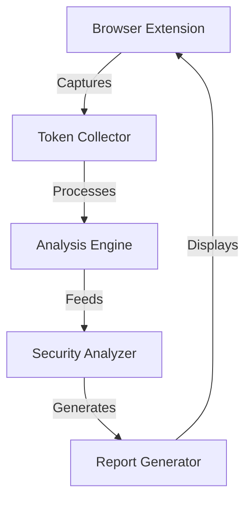

# Session Security Analyzer - System Architecture Design

## Workflow of Extension

1. Your browser extension captures session-related data:

- Cookies being set
- Local/session storage modifications
- Authentication form submissions
- HTTP headers (particularly Set-Cookie)

2. This data is analyzed in real-time:

- Token entropy and patterns
- Security configurations
- Session management behavior

3. The system generates alerts and reports:

- Security scores for different aspects
- Detailed vulnerability explanations
- Specific recommendations for fixes

## 1. High-Level Architecture

The system will follow a modular architecture with three main components:

1. Browser Extension Frontend
2. Token Analysis Engine
3. Reporting Service

### Component Interaction Flow

### Security Vulnerabilities to Check for

1. Token Randomness and Predictability

- Shannon entropy calculations measure how unpredictable the tokens are, with higher entropy indicating better randomness and security
- Tokens with low entropy might be guessable, similar to using sequential ID badge numbers
- The analyzer should detect common patterns that make tokens predictable

2. Dangerous Token Patterns

- Embedded timestamps that could reveal token creation time
- Sequential or incremental counters that make next values guessable
- User information directly encoded in the token, which could expose user data
- Simple Base64 encoding of values, which provides no real security

3. Cookie Configuration Security

- Missing HttpOnly flag allows JavaScript to access cookies, enabling cross-site scripting attacks
- Absence of Secure flag permits cookie transmission over insecure HTTP connections
- Incorrect SameSite attribute settings expose cookies to cross-site request forgery
- Overly permissive domain and path settings that allow cookies to be accessed by unauthorized endpoints

## Component Flow

when a user logs into a website, here's how the components interact:
1. The tokenCollector.js notices the login form submission through formInterceptor.js, and domObserver.js watches for the session token being set.

2. When a token is found, it's passed through the analysis engine:

- entropyCalculator.js measures how random and unpredictable it is
- patternDetector.js looks for any dangerous patterns
- tokenAnalyzer.js combines these results

3. The rule engine then evaluates the token:

- bestPractices.js provides the security standards
- securityRules.js implements the actual checks
- ruleEngine.js coordinates the evaluation

4. Finally, reportGenerator.js and visualizations.js present the findings to the user through the extension's interface.